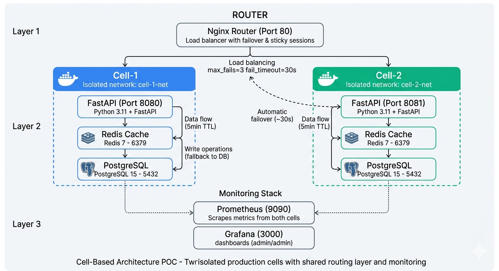

# Cell-Based Architecture POC

A proof of concept demonstrating a multi-cell architecture with isolated databases and caches, using Docker Compose.

## What is this?

Two independent "cells" that run separately but share a common router. Each cell has its own API, Redis cache, and PostgreSQL database. They're completely isolated - if one cell fails, the other keeps running.

## Architecture Diagram



## Quick Start

```bash
cd cell-poc
make start
```

## Commands

| Command | Description |
|---------|-------------|
| `make start` | Start all services |
| `make clean` | Stop and remove all containers |
| `make test` | Test auto-failover (~40s) |

## Endpoints

| Service | Port |
|---------|------|
| Router | 80 |
| Cell-1 API | 8080 |
| Cell-2 API | 8081 |
| Prometheus | 9090 |
| Grafana | 3000 |

## Key Features

- **Isolated cells** - Separate DB/cache per cell
- **Auto-failover** - Router switches to healthy cell
- **Sticky sessions** - Users stay on same cell
- **Monitoring** - Prometheus + Grafana included

## Documentation

See `plan/plan.md` for full implementation details.